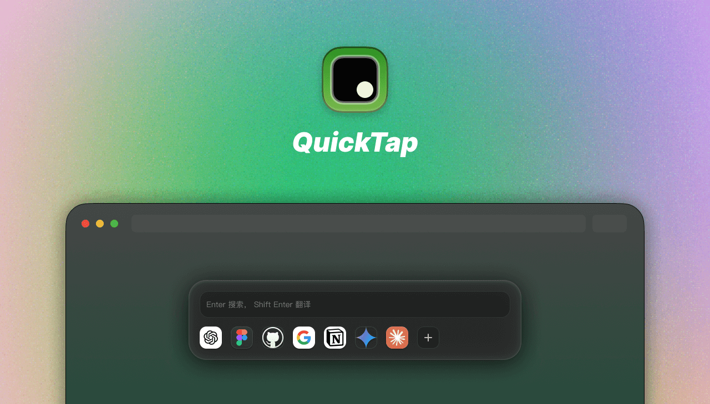

# QuickTap Chrome 扩展程序

QuickTap 是一个 Chrome 扩展程序，提供快速搜索、翻译和访问常用网站的功能。

## 🎯 核心功能

### 插件激活
- 使用快捷键 `Z` 唤起插件，输入状态下不生效。

### 搜索和翻译
- 在搜索框中输入文字并按下 Enter 键，立即进行 Google 搜索。
- 按下 Ctrl + Enter 键，自动补全网址并访问。
- 按下 Shift + Enter 键，立即进行翻译。

### 收藏应用
可一键收藏当前网页到应用列表，方便快速访问。
  - 右键应用图标可编辑/删除应用。
  - 支持修改应用地址，修改时根据地址实时获取网站图标。
  - 拖拽应用图标可进行排序。
  - 可自定义应用图标，支持本地上传和从剪贴板替换。

### 插件设置
在设置页面可自定义唤起插件的快捷键

